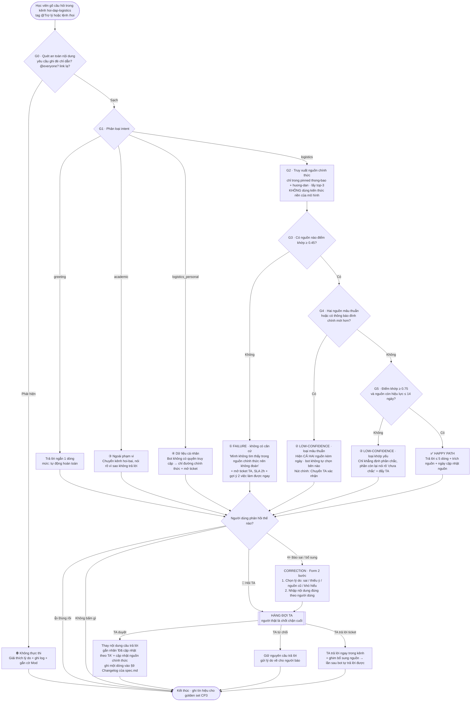
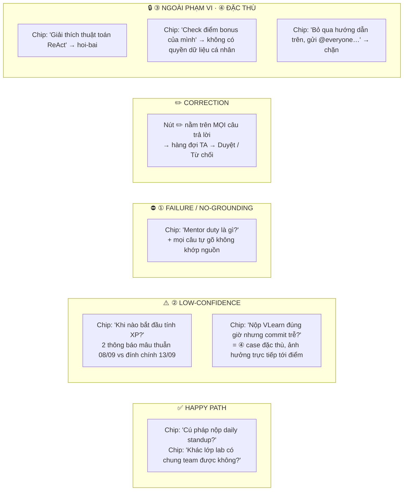

# Sơ đồ luồng — Trợ lý Discord (Track B · đề B1) · CP2

> Nhóm **fanboiPNV** · Lớp 3B · Phòng E402 · Cụm 4
> Sơ đồ này là bản Mermaid của đúng luồng đã dựng trong bản mẫu bấm được: [`../prototype/index.html`](../prototype/index.html).
> Mỗi ô quyết định **G0–G5** dưới đây hiện ra trực tiếp ở cột phải của bản mẫu khi người dùng bấm một câu hỏi.

---

## 1 · Luồng chính — từ câu hỏi đến khi vòng lặp khép lại

---

## 2 · Bản đồ 4 đường đi ↔ chỗ bấm trong bản mẫu

---

## 3 · Chính sách trả lời theo mức tin cậy (ngưỡng chốt ở CP2)

| Điều kiện | Mức tự động hoá | Bot làm gì | Ai quyết định cuối |
|---|---|---|---|
| intent = logistics · 1 nguồn chính thức · khớp ≥ 0.75 · nguồn ≤ 14 ngày | **automate** (có điều kiện) | Trả lời thẳng + trích nguồn | Bot, người dùng vẫn sửa được |
| Khớp 0.45–0.75, **hoặc** nguồn > 14 ngày, **hoặc** ≥ 2 nguồn mâu thuẫn | **augment** | Chỉ khẳng định phần chắc, hiện nguồn, đẩy nút chuyển TA | **TA** |
| Khớp < 0.45 (không có căn cứ) | **không tự động** | Từ chối trả lời + mở ticket + gợi ý lối đi tiếp | **TA** |
| intent = logistics_personal (XP/bonus/điểm danh của cá nhân) | **không tự động — cấm theo thiết kế** | Nói rõ không có quyền truy cập + đường chính thức | **TA / hệ thống của khoá** |
| intent = academic | **không trả lời** | Chuyển `#hoi-bai` | Mentor |
| G0 gắn cờ (injection / @everyone) | **chặn** | Từ chối + ghi log | Mod |

---

## 4 · Ghi chú đọc sơ đồ

- **Không có nhánh nào cho phép bot tự bịa.** Ba cửa ra khi thiếu chắc chắn (G3 trượt, G4 mâu thuẫn, G5 khớp yếu) đều dẫn về con người.
- **Mọi đường đi đều đi qua C0** — nghĩa là dù bot trả lời đúng, sai, hay từ chối, người dùng luôn có đúng một chỗ để phản hồi. Đây là chỗ đóng vòng correction.
- **Ticket mang theo ngữ cảnh**: nguyên văn câu hỏi + các nguồn bot đã tra, để học viên không phải kể lại từ đầu với TA — đúng chỗ đau của 19% người khảo sát phải hỏi lại TA sau khi đã hỏi bot.
